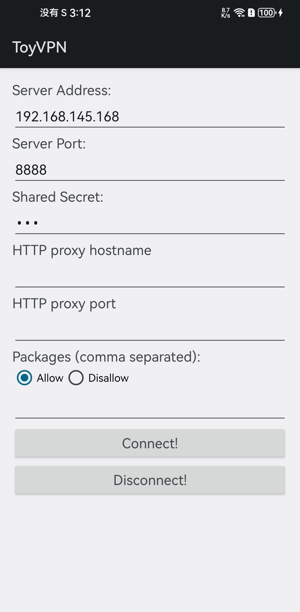

# 一、项目说明
此项目是一个简单的 vpn demo，之前都是阅读文章感性认识 vpn，借此 demo 理性认识 vpn。该工程的代码主要来源于：[Android VPN 示例](https://android.googlesource.com/platform/development/+/master/samples/ToyVpn)。

# 二、工程结构说明
## 1.app目录
存放 Android 项目文件，使用 VPNService 实现了一个简单的 VPN。
## 2.server目录
存放了使用c++实现的在linux下运行的服务端。

# 三、代码实现逻辑
客户端与服务器建立一条 socket 连接，与服务器对比密钥，确定是否建立连接。
socket连接建立后，启动 VPNService，此时，手机的所有流量都被传送到手机的 TUN 设备。
读取手机的 TUN 设备的数据，将数据通过 socket 发送到 服务器。服务器将该数据写入 TUN 设备，转发到公网。
公网返回数据将会写入服务器的 TUN 设备，服务器读取 TUN 设备数据通过 socket 连接发送给客户端。

# 四、使用
## 1.服务端
1）启动：
在 linux 系统中编译，然后通过命令启动服务器，示例：
sudo ./ToyVpnServer tun0 8888 123 -m 1500 -a 10.0.0.2 24 -r 0.0.0.0 0
命令解释：
sudo: 表示以 root 权限运行（创建 TUN 设备需要 root 权限）。
./ToyVpnServer: 即运行我们的 vpn服务端程序。
tun0: 指定 TUN 设备的名称。
8888: 指定服务器的端口号。
123: 指定服务器和客户端建立连接时的对比的密钥。
-m 1500: 指定 MTU 大小。
-a 10.0.0.2 24: 客户端与服务器建立连接后，指定客户端 TUN 设备的 ip 地址，24表示子网掩码。
-r 0.0.0.0 0: 配置客户端 TUN 设备的路由，此方式设置所有的数据都写入客户端的 TUN 设备。

2）启动服务器的 TUN 设备（linux）
通过上述步骤启动服务端后，需要配置并启动 linux 的 TUN 设备

// 配置 TUN 设备的 ip 地址
sudo ifconfig tun0 10.0.0.1

// 配置 TUN 设备的子网掩码
sudo ifconfig tun0 net mask 255.255.255.0

// 启动 TUN 设备
sudo ifconfig tun0 up

3）设置路由转发
linux 下默认不会将 TUN 设备的虚拟网络数据发送到其他网卡，通过以下命令将写入 TUN 设备的数据转发到物理网卡上发到公网：
```
// 这条命令的作用是启用IP转发。在Linux系统中，/proc/sys/net/ipv4/ip_forward文件用于控制系统是否进行IP转发。当其值为1时，系统会进行IP转发，即允许从一个网络接口接收的数据包通过另一个网络接口发送出去，实现网络之间的通信。这在配置路由器或防火墙时非常有用。这条命令就是将这个文件的值设置为1，启用IP转发。

sudo bash -c 'echo 1 > /proc/sys/net/ipv4/ip_forward'
```


4）设置NAT
将发送到物理网卡的数据包的源 ip 地址都更改为本机的 ip 地址。
```
这条命令的作用是在iptables的NAT表中添加一条POSTROUTING链的规则，将所有出接口为ens33的数据包进行源地址伪装（MASQUERADE）。
具体解释如下：
* sudo: 以管理员权限运行命令
* iptables: Linux系统的防火墙工具
* -t nat: 指定操作的表为NAT表
* -A POSTROUTING: 在POSTROUTING链（即数据包离开本机前的处理链）添加规则
* -o ens33: 指定出接口为ens33
* -j MASQUERADE: 执行的动作为MASQUERADE，即源地址伪装。这意味着所有出接口为ens33的数据包的源IP地址都会被替换为ens33接口的IP地址。
这条命令通常用于配置NAT（网络地址转换）或者IP Masquerading（IP伪装），使得内网的机器可以通过这台机器上网。

这里的 ens33 只是示例，需要根据实际情况修改（通过ifconfig 查询本机的网卡，找到本机的网卡名称替换到 ens33）

sudo iptables -t nat -A POSTROUTING -o ens33 -j MASQUERADE
```

## 2.客户端
编译 app，运行后，输入服务端的ip地址和端口号以及密钥，其他选项不填。（packages用于指定哪些应用会被发送到 TUN 设备，不指定则默认会将所有的数据发送到 TUN 设备），然后点击 connect 连接。



# 五、参考链接
1. [通过openvpn分析tun实现隧道的数据流程](https://www.junmajinlong.com/virtual/network/data_flow_about_openvpn/)

2. [Android VpnService使用总结](https://github.com/asdzheng/vpnservices)

3. [Linux Tun/Tap 介绍](https://www.zhaohuabing.com/post/2020-02-24-linux-taptun/)

4.[VPN 原理与实战开发](https://xzcoder.com/posts/network/05-simple-vpn.html)